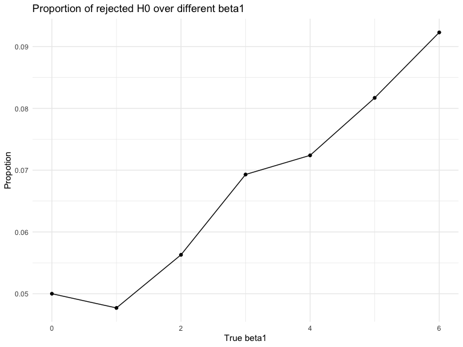

p8105\_hw5\_jy2965
================
Jun Yin
11/8/2019

## Problem 1

``` r
set.seed(10)
iris_with_missing = iris %>% 
  map_df(~replace(.x, sample(1:150, 20), NA)) %>%
  mutate(Species = as.character(Species))
```

``` r
#build the function
replace_na_fun = function(vec) {
  
  if (is.numeric(vec)) {
    vec[is.na(vec)] = mean(vec, na.rm = TRUE)
  } else if (is.character(vec)) {
    vec[is.na(vec)] = "virginica"
  } 

}
#using the function with for loop
iris_noneed = vector("list", length = 5)
for (i in 1:5) {
  
  iris_noneed[[i]] = replace_na_fun(iris_with_missing[[i]])
  
}
 
# Apply this function to the columns of iris_with_missing using a map statement
iris_without_missing = map_df(iris_with_missing,replace_na_fun) 
```

I replaeced missiong value based on the instruction and generated a new
dataset named
    iris\_withou\_missing.

## Problem 2

``` r
ldply(.data = "./data/hw5_data.zip", .fun = unzip, exdir= "./")
```

    ##                   V1                            V2                 V3
    ## 1 .//data/exp_05.csv .//__MACOSX/data/._exp_05.csv .//data/exp_04.csv
    ##                              V4                 V5
    ## 1 .//__MACOSX/data/._exp_04.csv .//data/exp_10.csv
    ##                              V6                 V7
    ## 1 .//__MACOSX/data/._exp_10.csv .//data/exp_06.csv
    ##                              V8                 V9
    ## 1 .//__MACOSX/data/._exp_06.csv .//data/exp_07.csv
    ##                             V10                V11
    ## 1 .//__MACOSX/data/._exp_07.csv .//data/exp_03.csv
    ##                             V12                V13
    ## 1 .//__MACOSX/data/._exp_03.csv .//data/exp_02.csv
    ##                             V14                V15
    ## 1 .//__MACOSX/data/._exp_02.csv .//data/exp_01.csv
    ##                             V16                V17
    ## 1 .//__MACOSX/data/._exp_01.csv .//data/con_06.csv
    ##                             V18                V19
    ## 1 .//__MACOSX/data/._con_06.csv .//data/con_07.csv
    ##                             V20                V21
    ## 1 .//__MACOSX/data/._con_07.csv .//data/con_05.csv
    ##                             V22                V23
    ## 1 .//__MACOSX/data/._con_05.csv .//data/con_10.csv
    ##                             V24                V25
    ## 1 .//__MACOSX/data/._con_10.csv .//data/con_04.csv
    ##                             V26                V27
    ## 1 .//__MACOSX/data/._con_04.csv .//data/con_01.csv
    ##                             V28                V29
    ## 1 .//__MACOSX/data/._con_01.csv .//data/con_03.csv
    ##                             V30                V31
    ## 1 .//__MACOSX/data/._con_03.csv .//data/con_02.csv
    ##                             V32                V33
    ## 1 .//__MACOSX/data/._con_02.csv .//data/con_09.csv
    ##                             V34                V35
    ## 1 .//__MACOSX/data/._con_09.csv .//data/con_08.csv
    ##                             V36                V37
    ## 1 .//__MACOSX/data/._con_08.csv .//data/exp_09.csv
    ##                             V38                V39
    ## 1 .//__MACOSX/data/._exp_09.csv .//data/exp_08.csv
    ##                             V40                V41
    ## 1 .//__MACOSX/data/._exp_08.csv .//__MACOSX/._data

``` r
pb2_data = as.data.frame(list.files(path = "./data/", pattern = "*.csv")) 
colnames(pb2_data)[1] = "file_names"
read_and_tidy = function(file_names){
     read.csv(str_c("./data/", file_names)) 
}
pb2_tidy_data = 
  mutate(pb2_data,subject_data = map(pb2_data$file_names, read_and_tidy)) %>% 
  unnest(subject_data) %>% 
  separate(file_names, into = c("group", "id"), sep = "_") %>% 
  mutate(id = sapply(id, substring, 1,2))

## spagehtti plot
  graph_plot=
    pb2_tidy_data %>% 
  pivot_longer(
    week_1:week_8,
    names_to = "week",
    values_to = "results"
  ) %>% 
   mutate(week_number = sapply(week, substring, 6,6))
  graph_plot %>% 
  ggplot(aes(x = week_number, y = results, group = id, color = id)) +
  geom_line() +
  facet_grid(~ group) +
  labs(
    title = "Observations on Each Subject over Time",
    x = "Week",
    y = "results",
    caption = "Data from a longitudinal study") +
    theme(legend.position = "bottom")
```


As we can see from the graph, the results of control group don’t have
any increasing or decreasing trend over 8 weeks, but the results of
experiment group increased through 8 weeks. At the beginning of the
experiment, the mean of the results of control group is 0.915, and the
mean of the value of experiment group is 1.141, which are almost the
same. However, the value of the experiment group significantly increased
over this 8-weeks study, whereas the control group didn’t change a lot
(actually decreased a little bit). At the end of this study, the mean
value of the control group is 0.74, and the mean value of the experiment
group is 5.119.

## problem 3

``` r
set.seed(1)
```

``` r
#create the function of linear regrssion
sim_regression = function(n=30, beta0 = 2, beta1) {
  
  sim_data = tibble(
    x = rnorm(n, mean = 0, sd = 1),
    sigma_square = 50,
    y = beta0 + beta1 * x + rnorm(n, 0, sd = sigma_square)
  )
  
  ls_fit = lm(y ~ x, data = sim_data)
  tibble( 
    beta1_hat = coef(ls_fit)[2],
    p_value = broom::tidy(ls_fit)$p.value[2]
  )
 
}
#using for loop to generate model dataset with different beta1
model_beta1 = vector("list", length = 7)
for (i in 1:7) {
  model_beta1[[i]] = rerun(10000,sim_regression(beta1 = i-1)) %>% 
  bind_rows() 
}

#generate dataset for first plot
plot_model_beta1 = vector("list", length = 7)
for (i in 1:7) {
  plot_model_beta1[[i]]=
  model_beta1[[i]] %>% 
  mutate(reject = ifelse(p_value<0.05, 1, 0)) %>% 
  group_by(reject) %>% 
  dplyr::summarize(n = n()) %>% 
  mutate(proportion = n/sum(n)) %>% 
  filter(reject==1)
}
proportion_plot = bind_rows(plot_model_beta1)%>% 
mutate(beta1 = c(0,1,2,3,4,5,6))
proportion_plot%>% 
  ggplot(aes(x=beta1, y = proportion))+
  geom_point()+
  geom_line()+
  labs(
     title = "Proportion of rejected H0 over different beta1",
    x = "True beta1",
    y = "Propotion"
  )
```



**Describe the association between effect size and power**

``` r
#second plot
plot2_model_beta1 = vector("list", length = 7)
for (i in 1:7) {
  plot2_model_beta1[[i]]=
  model_beta1[[i]] %>% 
  pivot_longer(beta1_hat,
               names_to = "parameter",
               values_to = "beta1"
               ) %>% 
  group_by(parameter) %>% 
  summarize(mean_beta = mean(beta1))
}
es_vs_true_beta1 = bind_rows(plot2_model_beta1) %>% 
  mutate(true_beta = c(0,1,2,3,4,5,6))
es_vs_true_beta1 %>% 
  ggplot(aes(x = true_beta, y = mean_beta))+
  geom_point()+
  geom_line()+
  labs(
     title = "Average estimate of beta1 VS True beta1",
    x = "True beta1",
    y = "Average estimate of beta1"
  )
```


``` r
#third plot

plot3_model_beta1 = vector("list", length = 7)
for (i in 1:7) {
  plot3_model_beta1[[i]]=
  model_beta1[[i]] %>%
  mutate(reject = ifelse(p_value<0.05, 1, 0)) %>% 
  filter(reject==1) %>% 
  pivot_longer(beta1_hat,
               names_to = "parameter",
               values_to = "beta1"
               ) %>% 
  group_by(parameter) %>% 
  summarize(mean_beta = mean(beta1))
}
es_vs_true_beta1_reject = bind_rows(plot3_model_beta1) %>% 
  mutate(true_beta = c(0,1,2,3,4,5,6))
es_vs_true_beta1_reject %>% 
  ggplot(aes(x = true_beta, y = mean_beta))+
  geom_point()+
  geom_line()+
  labs(
     title = "Average estimate of beta1 VS True beta1 in reject H0 group",
    x = "True beta1",
    y = "Average estimate of beta1"
  )
```


**Is the sample average of β̂ 1 across tests for which the null is
rejected approximately equal to the true value of β1? Why or why not?**
